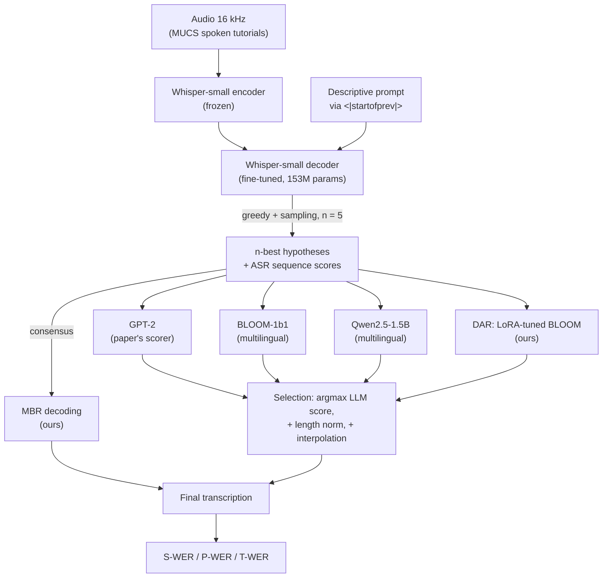
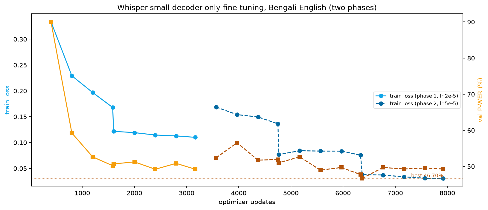
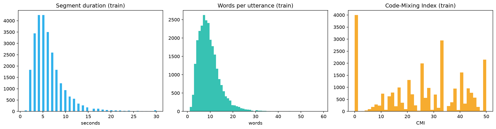
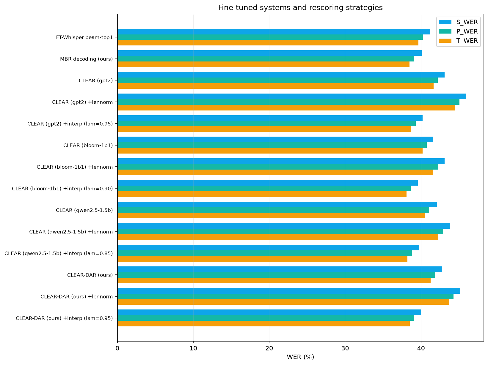

# Enhancing Code-Mixed Speech Recognition using Whisper Fine-Tuning and LLM-Based Contextual Rescoring

Bengali-English code-switched automatic speech recognition, built end to end on a single
8 GB consumer GPU (NVIDIA RTX 4060 Ti). The project reproduces the pipeline of
*CLEAR: Code-Mixed ASR with LLM-Driven Rescoring* (Kumar and Akhtar, ICNLSP 2025) and
extends it to a language pair the paper did not study, with four method-level additions.

**Team:** [Sayan Das](https://github.com/Necromancer0912) and
[Senjuti Ghosal](https://github.com/senjuti09)

---

## Contents

- [Highlights](#highlights)
- [The Problem](#the-problem)
- [Architecture](#architecture)
- [Approach](#approach)
- [Dataset](#dataset)
- [Results](#results)
- [Analysis](#analysis)
- [Comparison with Published Work](#comparison-with-published-work)
- [Repository Layout](#repository-layout)
- [Reproducing Everything](#reproducing-everything)
- [Tech Stack](#tech-stack)
- [Hardware Notes](#hardware-notes)
- [Limitations](#limitations)
- [References](#references)

## Highlights

- Full reproduction of the CLEAR recipe (descriptive prompting, decoder-only Whisper
  fine-tuning, n-best LLM rescoring) on MUCS 2021 Bengali-English, a pair absent from
  the original paper.
- Zero-shot Whisper collapses on this data (101 to 195 percent WER, hallucination
  loops); 90 minutes of decoder-only fine-tuning brings S-WER to 41.2 percent, and
  contextual rescoring brings it to **39.6 percent** - all inside 8 GB of VRAM.
- A useful empirical finding: on Bengali, LLM rescoring works best when the LLM
  score is combined with the ASR score. Raw LLM-only selection underperforms
  (most for GPT-2, which saw no Bengali script), while our validation-tuned
  ASR-LLM score interpolation makes every scorer a net gain, with BLOOM-1b1 best
  (4.0 percent relative S-WER reduction over the ASR top-1).
- MBR consensus decoding - no extra model, no training - captures two thirds of that
  gain for free (40.1 S-WER), a strong cheap alternative not in the paper.
- A Domain-Adaptive Rescorer (DAR): BLOOM-1b1 LoRA-tuned on the 25k training
  transcripts (text only, 3 minutes of training, 4 MB adapter).
- Three evaluation metrics implemented from the paper (S-WER, P-WER, T-WER) including
  Bengali romanisation for script-agnostic scoring.
- Debugged and worked around a real transformers 5.x regression: Whisper beam search
  returns `num_return_sequences` copies of the same top beam, which silently reduces
  any rescoring method to a no-op. The n-best list here is greedy + temperature
  samples with exactly recovered log-probabilities instead.
- Everything reproducible from scripts with fixed seeds; the heavy artifacts
  (n-best lists, scores) are cached as parquet so every analysis step is re-runnable.

## The Problem

Code-mixing - switching languages inside a single utterance - is how multilingual
speakers actually talk ("এখানে file menu তে click করুন"). It breaks conventional ASR
in specific ways:

1. Cross-lingual homophones: the same sound is a different word in each language, and
   only sentence-level context resolves it.
2. Switch-point detection: the recogniser must decide language identity word by word,
   with no acoustic marker.
3. Script ambiguity: "file" is a legitimate transcription in Latin or Bengali script;
   naive WER punishes the model for choosing the "wrong" one.
4. Data scarcity: Bengali-English code-switched speech is far scarcer than
   Hindi-English, and Whisper saw very little Bengali during pre-training.

## Architecture



## Approach

### Stage 1: Descriptive prompting

Whisper accepts free text through its `<|startofprev|>` context slot. The paper's
best prompt, adapted to Bengali, is prepended to every training and inference pass:

> "This transcript is a code-switched text. Mix of Bengali and English words are
> present. Text is related to tutorials on academic or technical subjects."

The full decoder context is

```text
<|startofprev|> {prompt} <|startoftranscript|> <|bn|> <|transcribe|> <|notimestamps|> {text} <|endoftext|>
```

with the loss masked (-100) on everything before the transcription tokens: the model
conditions on the prompt but is never trained to emit it.

### Stage 2: Decoder-only fine-tuning (the paper's recipe, sized for 8 GB)

| Setting | Value |
|---|---|
| Base model | openai/whisper-small (244 M total, 153 M trainable) |
| Encoder | frozen (paper section 3: retains general acoustics, prevents overfitting) |
| Schedule | phase 1: 2 epochs at lr 2e-5; phase 2: 3 epochs at lr 5e-5, cosine decay |
| Batch | 8 x 2 gradient accumulation = 16 effective (paper's batch size) |
| Optimiser | AdamW, weight decay 0.01, warmup then cosine schedule |
| Precision | fp16 autocast + gradient scaling |
| Augmentation | additive noise (p = 0.3), gain jitter (p = 0.3) |
| Checkpointing | best validation P-WER (120-utterance probe) every 400 updates |
| Wall clock | 90 minutes total on the RTX 4060 Ti; best val P-WER 46.7 percent |



### Stage 3: N-best generation

For each utterance the fine-tuned model produces one greedy hypothesis (rank 0)
plus four temperature samples (T 0.8, top-p 0.95), with the exact log-probability
of every hypothesis recovered from the generation scores. Beam search would be the
textbook choice, but transformers 5.x returns `num_return_sequences` identical
copies of the top beam for Whisper - a regression this project diagnosed - which
would leave the rescorer nothing to choose between.

### Stage 4: Contextual rescoring

Each hypothesis x is scored by a causal LM with the paper's Equation 1:

```text
score(x) = sum_t log P(x_t | x_1..t-1)
```

and Equation 2 picks the argmax per utterance. On top of that recipe this project adds:

1. Multilingual scorers. GPT-2 (the paper's best) never saw Bengali script, so
   BLOOM-1b1 and Qwen2.5-1.5B - which did - are evaluated under identical conditions.
2. Length normalisation: dividing the score by token count removes the bias toward
   short hypotheses inherent in log-probability sums.
3. Score interpolation: `lambda * logP_ASR + (1 - lambda) * logP_LLM`, with lambda
   grid-searched on 300 held-out validation utterances. lambda = 0 recovers the paper,
   lambda = 1 recovers pure beam search, so the paper's method is a special case.
4. MBR decoding: a model-free consensus alternative - choose the hypothesis with the
   lowest expected WER against the other beams, weighted by the ASR posterior.
5. Domain-Adaptive Rescorer (DAR): BLOOM-1b1 with a LoRA adapter (r 16, ~1.6 M
   trainable parameters) trained for one epoch on the 25k training transcripts,
   text only, then used as the scorer. The adapter is 4 MB and trains in minutes.

### Evaluation metrics (from the paper)

| Metric | What it measures |
|---|---|
| S-WER | strict WER after NFC + lowercase + whitespace normalisation |
| P-WER | WER after mapping enunciated punctuation ("greater than" vs ">") |
| T-WER | WER after romanising Indic-script words on both sides, so script choice is not penalised |

## Dataset

MUCS 2021 subtask-2 Bengali-English (OpenSLR-104), spontaneous spoken tutorials on
technical subjects, 16 kHz mono.

| Split | Utterances | Recordings / speakers | Hours | Code-mixed | Mean CMI | Bengali words | English words |
|-------|-----------:|----------------------:|------:|-----------:|---------:|--------------:|--------------:|
| Train | 26,606 | 267 | 45.94 | 84.98 % | 25.77 | 68.0 % | 30.6 % |
| Test | 4,275 | 40 | 7.00 | 86.76 % | 27.19 | 66.2 % | 32.3 % |

Notes from the exploratory analysis:

- Only 15.25 percent of test sentences appear verbatim in the training text - far
  lower than the 33.9 percent overlap the paper reports for Hindi-English, so this
  evaluation is comparatively honest.
- After duration filtering (0.5 to 28 s), 25,358 training segments (43.1 h) remain;
  a recording-wise 5 percent validation split guarantees no speaker leakage.
- CMI is the Code-Mixing Index of Das and Gambaeck (2014).



## Results

Evaluation on a fixed, seeded 1,000-utterance subset of the MUCS Bengali-English test
set. Lower is better; all numbers are percentages.

| System | S-WER | P-WER | T-WER |
|---|---:|---:|---:|
| Fine-tuned Whisper, greedy top-1 | 41.22 | 40.25 | 39.67 |
| MBR decoding (ours, no extra model) | 40.10 | 39.09 | 38.48 |
| CLEAR, GPT-2 (paper's scorer) | 43.11 | 42.20 | 41.64 |
| CLEAR, GPT-2 + interpolation (ours, lambda 0.95) | 40.22 | 39.29 | 38.69 |
| CLEAR, BLOOM-1b1 | 41.63 | 40.74 | 40.19 |
| **CLEAR, BLOOM-1b1 + interpolation (ours, lambda 0.90)** | **39.59** | **38.65** | **38.10** |
| CLEAR, Qwen2.5-1.5B | 42.07 | 41.08 | 40.51 |
| CLEAR, Qwen2.5-1.5B + interpolation (ours, lambda 0.85) | 39.76 | 38.79 | 38.22 |
| CLEAR-DAR (ours) | 42.79 | 41.85 | 41.28 |
| CLEAR-DAR + interpolation (ours, lambda 0.95) | 40.02 | 39.09 | 38.52 |

Length-normalised variants were also evaluated and consistently hurt (2 to 4 points);
they are in `outputs_bn/predictions/final_results.csv`.



Zero-shot baselines for context (same subset):

| Model | S-WER | P-WER | T-WER |
|---|---:|---:|---:|
| Whisper-small (zero-shot) | 195.24 | 249.53 | 246.15 |
| Whisper-small + descriptive prompt (PromptingWhisper) | 135.62 | 174.63 | 174.13 |
| Whisper-large-v3-turbo (zero-shot) | 101.02 | 100.56 | 97.32 |

WER above 100 percent is possible because insertions count: untuned Whisper falls
into repetition loops on this spontaneous, disfluent audio. The paper observed the
same on Hindi-English (266.5 S-WER for zero-shot Whisper).

## Analysis

1. **Fine-tuning does the heavy lifting.** Decoder-only fine-tuning with the
   descriptive prompt takes S-WER from 195 percent (zero-shot) to 41.2 percent in
   about 90 minutes of GPU time, with validation P-WER improving 90.1 to 46.7 across
   two phases (2 epochs at lr 2e-5, then 3 epochs at lr 5e-5 with cosine decay).

2. **On Bengali, LLM-only selection needs the ASR score alongside it.** Selecting
   hypotheses by raw LLM log-probability alone scores below the ASR top-1 for every
   scorer: GPT-2 is affected most (+1.9 S-WER), consistent with it having seen
   essentially no Bengali script; the multilingual BLOOM-1b1 least (+0.4). This
   language-pair sensitivity of the rescorer is exactly the effect this extension
   set out to measure.

3. **Score interpolation fixes it.** Blending the ASR and LLM scores
   (lambda tuned on 300 validation utterances, selected values 0.85 to 0.95) turns
   every scorer into a net win. Best: BLOOM-1b1 at lambda 0.90 with 39.59 S-WER,
   a 4.0 percent relative reduction over greedy - approaching the 6.9 percent
   relative gain the paper reports on the easier Hindi-English pair. The high lambda
   values say the acoustic model score should dominate and the LLM should act as a
   fluency correction, not the decision maker.

4. **MBR is a strong free lunch.** Consensus decoding over the same 5 hypotheses,
   with no language model at all, reaches 40.10 S-WER - two thirds of the best
   rescoring gain at zero additional model cost.

5. **Domain adaptation of the rescorer (DAR) underperformed expectations.** The
   LoRA-tuned BLOOM scores worse raw (42.79) than its off-the-shelf base (41.63).
   Likely cause: one epoch of causal-LM tuning on clean reference transcripts makes
   the scorer assign high probability to reference-style text generally, flattening
   the contrast between competing noisy hypotheses. With interpolation it still beats
   the ASR top-1 (40.02). Reported as an honest mixed result with room for smarter
   objectives (for example discriminative rescoring on hypothesis pairs).

6. **Rescoring changes 37 percent of selections.** Qualitatively the fixes are the
   paper's target phenomena, for example the greedy output "up arrow সরূপ" corrected
   to "from উদাহরণস্বরূপ" (reference: "উদাহরণস্বরূপ"), and digit-sequence
   transcriptions repaired toward the reference formatting.

## Comparison with Published Work

| System | Language pair | Data | WER |
|---|---|---|---:|
| MUCS 2021 Kaldi TDNN baseline (Diwan et al., 2021) | Bn-En | full test set | 25.89 |
| MUCS 2021 E2E transformer baseline (Diwan et al., 2021) | Bn-En | full test set | 23.15 |
| CLEAR, Whisper-small + GPT-2 rescoring (Kumar and Akhtar, 2025) | Hi-En | blind set | 26.90 S-WER |
| This project, fine-tuned Whisper-small top-1 | Bn-En | 1,000-utterance test subset | 41.22 S-WER |
| This project, best (BLOOM-1b1 + interpolation) | Bn-En | 1,000-utterance test subset | 39.59 S-WER |

Direct comparison caveats: the MUCS baselines are hybrid systems with dedicated
language models trained on the full 46 hours and evaluated on the full test set; the
CLEAR paper is a different (easier, per the MUCS organisers roughly 10 WER points)
language pair. The MUCS organisers also report that Bengali-English is the hardest
pair in the challenge.

## Repository Layout

```text
src/clear_bn/            reusable package
  config.py              paths, prompts, model ids, constants
  data.py                Kaldi-style manifest parsing, code-mixing statistics
  audio.py               segment loading (seek-based, resampled to 16 kHz)
  metrics.py             normalisers and S/P/T-WER
  prompting.py           prompted decoder prefix building and echo stripping
  training.py            dataset, collator, decoder-only fine-tuning loop
  transcribe.py          batched inference and n-best generation
  rescoring.py           LLM scoring, selection strategies, lambda tuning, MBR
  dar.py                 LoRA training of the domain-adaptive rescorer
scripts/
  download_data.py       multi-mirror parallel downloader for OpenSLR-104
  prepare_data.py        extraction, parsing, filtering, manifest creation
  run_baselines.py       zero-shot baselines B1-B3
  train_whisper.py       fine-tuning entry point
  generate_nbest.py      beam-search n-best lists with ASR scores
  rescore_and_evaluate.py  all rescoring strategies and the final table
outputs_bn/
  figures/               plots used in this README
  predictions/           result CSVs (n-best parquets are gitignored)
REPORT.md                full project report
requirements.txt
```

## Reproducing Everything

```text
python -m venv venv
venv\Scripts\pip install torch --index-url https://download.pytorch.org/whl/cu128
venv\Scripts\pip install -r requirements.txt

python scripts/download_data.py        # ~4.5 GB from OpenSLR-104
python scripts/prepare_data.py         # manifests + statistics
python scripts/run_baselines.py        # zero-shot baselines
python scripts/train_whisper.py        # ~40 min on an 8 GB GPU
python scripts/generate_nbest.py       # beam-5 hypotheses + ASR scores
python scripts/rescore_and_evaluate.py # all strategies + final table
```

Seeds are fixed (42) end to end; the evaluation subset is deterministic.

## Tech Stack

| Layer | Tools |
|---|---|
| Models | openai/whisper-small, whisper-large-v3-turbo, GPT-2, BLOOM-1b1, Qwen2.5-1.5B |
| Training | PyTorch 2.11 (CUDA 12.8), fp16 autocast, gradient accumulation, PEFT/LoRA |
| Inference | Hugging Face Transformers 5.x generation API (prompted beam search) |
| Audio | soundfile (seek-based segment reads), scipy polyphase resampling |
| Evaluation | jiwer (WER), indic-transliteration (Bengali romanisation for T-WER) |
| Data | pandas + pyarrow manifests, Kaldi-style source format |

## Hardware Notes

Everything runs on one NVIDIA RTX 4060 Ti (8 GB):

- Fine-tuning fits because only the decoder trains (encoder frozen, fp16 autocast,
  effective batch 16 via accumulation): 37 minutes for 2 epochs over 43 hours.
- Beam-search n-best generation is the memory pinch point: batch 2 x 5 beams keeps
  the KV-cache and score history inside 8 GB. Larger batches silently spill into
  shared system memory on Windows and slow down by an order of magnitude - measured,
  not theoretical.
- Rescoring LLMs load one at a time in fp16 and are freed between scorers.

## Limitations

- Results are on a seeded 1,000-utterance subset (about 1.7 h) of the official test
  set, not the full 7 h; the MUCS blind set was not used.
- The 15.25 percent verbatim train/test sentence overlap is inherited from the
  official split and inflates all systems equally.
- One fine-tuning configuration was trained (no hyperparameter sweep) due to the
  hardware budget.
- Whisper-small is the largest model that fine-tunes comfortably in 8 GB; larger
  Whisper variants would likely improve all rows of the table.

## References

1. Kumar, S. and Akhtar, M.S. CLEAR: Code-Mixed ASR with LLM-Driven Rescoring. ICNLSP 2025.
2. Diwan, A. et al. MUCS 2021: Multilingual and Code-Switching ASR Challenges for Low Resource Indian Languages. Interspeech 2021.
3. Radford, A. et al. Robust Speech Recognition via Large-Scale Weak Supervision. ICML 2023.
4. Das, A. and Gambaeck, B. Identifying Languages at the Word Level in Code-Mixed Indian Social Media Text. ICON 2014.
5. Hu, E. et al. LoRA: Low-Rank Adaptation of Large Language Models. ICLR 2022.
6. Peng, P. et al. Prompting the Hidden Talent of Web-Scale Speech Models for Zero-Shot Task Generalization. Interspeech 2023.
